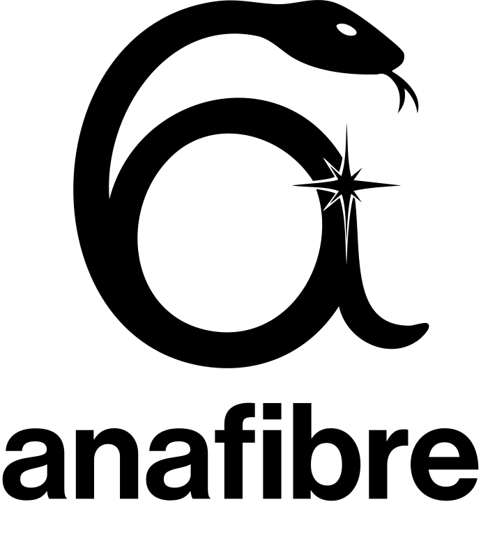

<!-- 
<h1>
<p align="center">
  <picture>
    <source media="(prefers-color-scheme: dark)" srcset="./assets/logos/logo-dark.svg">
    <source media="(prefers-color-scheme: light)" srcset="./assets/logos/logo-light.svg">
    
  </picture>
</p>
</h1><br> -->
<h1>
<p align="center">
  <picture>
    <source media="(prefers-color-scheme: dark)" srcset="https://raw.githubusercontent.com/Sevastienn/anafibre/refs/heads/main/assets/logos/logo-dark.svg">
    <source media="(prefers-color-scheme: light)" srcset="https://raw.githubusercontent.com/Sevastienn/anafibre/refs/heads/main/assets/logos/logo-light.svg">
    
  </picture>
</p>
</h1><br>

[](https://opensource.org/licenses/MIT)
[](https://pypi.org/project/anafibre/)
[](https://www.python.org/downloads/)
[![arXiv](https://img.shields.io/badge/arXiv-2602.14930-B31B1B?logo=data:image/svg+xml;base64,PHN2ZyBpZD0ibG9nb21hcmsiIHhtbG5zPSJodHRwOi8vd3d3LnczLm9yZy8yMDAwL3N2ZyIgdmlld0JveD0iMCAwIDE3LjczMiAyNC4yNjkiPjxnIGlkPSJ0aW55Ij48cGF0aCBkPSJNNTczLjU0OSwyODAuOTE2bDIuMjY2LDIuNzM4LDYuNjc0LTcuODRjLjM1My0uNDcuNTItLjcxNy4zNTMtMS4xMTdhMS4yMTgsMS4yMTgsMCwwLDAtMS4wNjEtLjc0OGgwYS45NTMuOTUzLDAsMCwwLS43MTIuMjYyWiIgdHJhbnNmb3JtPSJ0cmFuc2xhdGUoLTU2Ni45ODQgLTI3MS41NDgpIiBmaWxsPSIjYmRiOWI0Ii8+PHBhdGggZD0iTTU3OS41MjUsMjgyLjIyNWwtMTAuNjA2LTEwLjE3NGExLjQxMywxLjQxMywwLDAsMC0uODM0LS41LDEuMDksMS4wOSwwLDAsMC0xLjAyNy42NmMtLjE2Ny40LS4wNDcuNjgxLjMxOSwxLjIwNmw4LjQ0LDEwLjI0MmgwbC02LjI4Miw3LjcxNmExLjMzNiwxLjMzNiwwLDAsMC0uMzIzLDEuMywxLjExNCwxLjExNCwwLDAsMCwxLjA0LjY5QS45OTIuOTkyLDAsMCwwLDU3MSwyOTNsOC41MTktNy45MkExLjkyNCwxLjkyNCwwLDAsMCw1NzkuNTI1LDI4Mi4yMjVaIiB0cmFuc2Zvcm09InRyYW5zbGF0ZSgtNTY2Ljk4NCAtMjcxLjU0OCkiIGZpbGw9IiNiMzFiMWIiLz48cGF0aCBkPSJNNTg0LjMyLDI5My45MTJsLTguNTI1LTEwLjI3NSwwLDBMNTczLjUzLDI4MC45bC0xLjM4OSwxLjI1NGEyLjA2MywyLjA2MywwLDAsMCwwLDIuOTY1bDEwLjgxMiwxMC40MTlhLjkyNS45MjUsMCwwLDAsLjc0Mi4yODIsMS4wMzksMS4wMzksMCwwLDAsLjk1My0uNjY3QTEuMjYxLDEuMjYxLDAsMCwwLDU4NC4zMiwyOTMuOTEyWiIgdHJhbnNmb3JtPSJ0cmFuc2xhdGUoLTU2Ni45ODQgLTI3MS41NDgpIiBmaWxsPSIjYmRiOWI0Ii8+PC9nPjwvc3ZnPg==)](https://arxiv.org/abs/2602.14930)
[](https://orcid.org/0000-0003-3947-7634)


**Anafibre** is an analytical mode solver for cylindrical step-index optical fibres. It computes guided modes by solving dispersion relations and evaluating corresponding electromagnetic fields analytically.

## Features

- 🔬 **Analytical solutions** for guided modes in cylindrical fibres
- 🌈 **Mode visualisation** with plotting utilities for field components
- 📊 **Dispersion analysis** helpers and effective index calculations
- ⚡ **Fast computation** of propagation constants with [SciPy](https://github.com/scipy/scipy)-based root finding
- 🎯 **Flexible materials** support via fixed indices, callables or [refractiveindex.info](https://refractiveindex.info/) database 
- 📐 **Optional unit support** through [Astropy](https://github.com/astropy/astropy)

## Installation

### Install from PyPI
```bash
pip install anafibre
```

### Optional extras
- Units support using [`astropy.units.Quantity`](https://docs.astropy.org/en/stable/units/quantity.html)
  ```bash
  pip install "anafibre[units]"
  ```
- [refractiveindex.info](https://refractiveindex.info/) database support
  ```bash
  pip install "anafibre[refractiveindex]"
  ```
- All optional features (units + [refractiveindex.info](https://refractiveindex.info/))
  ```bash
  pip install "anafibre[all]"
  ```

## Core API Overview

Anafibre has two main objects:
- `StepIndexFibre` — defines the waveguide (geometry + materials)
- `GuidedMode` — represents a single solved eigenmode

The typical workflow is:
```python
# Set up the fibre
fibre = fib.StepIndexFibre(core_radius=250e-9, n_core=2.00, n_clad=1.33)
# Set up the fundamental mode (here with x polarisation)
HE11 = fibre.HE(ell=1, n=1, wl=700e-9, a_plus=1/np.sqrt(2), a_minus=1/np.sqrt(2))
# Construct the grid
x = np.linspace(-2*fibre.core_radius, 2*fibre.core_radius, 100)
y = np.linspace(-2*fibre.core_radius, 2*fibre.core_radius, 100)
X, Y = np.meshgrid(x, y)
# Evaluate the field on the grid 
E = mode.E(x=X, y=Y)
```

---
### `StepIndexFibre`

Defines the fibre geometry and material parameters and provides dispersion utilities.

#### Required inputs

- `core_radius` (float in meters or `astropy.units.Quantity`)
- One of:
  - `core`, `clad` as `RefractiveIndexMaterial`
  - `n_core`, `n_clad` (float or callable *λ→ε*(*λ*))
  - `eps_core`, `eps_clad` (float or callable *λ→ε*(*λ*))
#### Optional inputs
- `mu_core`, `mu_clad` (float or callable *λ→ε*(*λ*))

#### Example

  ```python
  fibre = fib.StepIndexFibre(core_radius=250e-9, n_core=2.00, n_clad=1.33)

  # Or with astropy.units imported as u and with refractiveindex installed:
  fibre = fib.StepIndexFibre(
    core_radius = 250*u.nm,
    core = fib.RefractiveIndexMaterial('main','Si3N4','Luke'),
    clad = fib.RefractiveIndexMaterial('main','H2O','Hale'))
  ```

#### Provides
- **Mode constructors** for HE<sub>ℓn&nbsp;</sub>, EH<sub>ℓn&nbsp;</sub>, TE<sub>0n&nbsp;</sub>, and TM<sub>0n</sub> modes
  ```python
  fibre.HE(ell, n, wl, a_plus=..., a_minus=...)
  fibre.EH(...)
  fibre.TE(n, wl, a=...)
  fibre.TM(...)
  ```
  Each returns a `GuidedMode` object.

- **Dispersion utilities** to find *V, b, k<sub>z </sub>,*&nbsp;and *n*<sub>eff</sub> and the dispersion function *F* for given parameters
  ```python
  fibre.V(wavelength)
  fibre.b(ell, m, V=..., wavelength=..., mode_type=...)
  fibre.kz(...)
  fibre.neff(...)
  fibre.F(ell, b, V=..., wavelength=..., mode_type=...)
  ```

- **Geometry and material properties** as attributes
  ```python
  fibre.core_radius
  fibre.n_core(wavelength)
  fibre.n_clad(...)
  fibre.eps_core(...)
  fibre.eps_clad(...)
  fibre.mu_core(...)
  fibre.mu_clad(...)

  ```

- **Maximum mode order** supported for a given wavelength
  ```python
  fibre.ell_max(wavelength, m=1, mode_type=...)
  fibre.m_max(ell, wavelength, mode_type=...)
  ```
---
### `GuidedMode`

Represents a guided mode with methods to calculate fields and properties. It is created using `StepIndexFibre` mode constructors.

#### Provides
- Field evaluation in (ρ,ϕ,z) or (x,y,z) coordinates, when z is not provided z=0 is assumed
  ```python
  E = mode.E(rho=Rho, phi=Phi, z=Z)
  H = mode.H(rho=Rho, phi=Phi, z=Z)
  E = mode.E(x=X, y=Y, z=Z)
  H = mode.H(x=X, y=Y, z=Z)
  ```
 Both return arrays with a shape (..., 3) corresponding to the Cartesian vector components. Note that if a grid is passed to the function then it is cached, so subsequent calls with the same grid (for example to get magnetic field) will be much faster.
- Jacobians (gradients) of the fields
  ```python
  J_E = mode.gradE(rho=Rho, phi=Phi, z=Z)
  J_H = mode.gradH(rho=Rho, phi=Phi, z=Z)
  J_E = mode.gradE(x=X, y=Y, z=Z)
  J_H = mode.gradH(x=X, y=Y, z=Z)
  ```
 Both return arrays with a shape of (..., 3, 3), corresponding to the Cartesian tensor components.
- Power evaluated via numerical integration
  ```python
  P = mode.Power()
  ```


### Visualisation
The package ships with a built-in plotting utility that creates time-resolved animations of the electromagnetic field in the transverse cross-section of the fibre. There are two options for using it:
- Option A − Passing the mode(s) with weights to the `animate_fields_xy` function directly:
  ```python
  anim = fib.animate_fields_xy(
        modes=None,            # GuidedMode or list[GuidedMode]
        weights=None,          # complex or list[complex] (amplitudes/relative phases), default 1
        n_radii=2.0,           # grid half-size in units of core radius (when building grid)
        Np=200,                # grid resolution per axis
        ...)
  ```
- Option B − Passing fields with their own ω:
  ```python
  anim = fib.animate_fields_xy(
        fields=None,           # list of tuples (E, H, omega) with E/H phasors on same X,Y grid
        X=None, Y=None,        # grid for Option B (required if fields given)
        z=0.0,                 # z-slice to evaluate modes at (ignored if fields given)
        ...)
  ```
Whichever way you choose, the resulting `anim` object is a standard [Matplotlib animation](https://matplotlib.org/stable/api/_as_gen/matplotlib.animation.Animation.html) and can be displayed in Jupyter notebooks or saved to file. One can also specify which field components to show (E, H, or both) and figure size instead of `...` in the above snippets.
  ```python
  anim = fib.animate_fields_xy(
        ...,
        show=("E", "H"),       # any subset of {"E","H"}
        n_frames=60,           # number of frames in the animation 
        interval=50,           # delay between frames in ms 
        figsize=(8, 4.5))      # figure size in inches (width, height)
  ```
Finally, the animation can be displayed in a Jupyter notebook using the `display_anim` helper function:
```python
fib.display_anim(anim)
```
or saved to file using the standard Matplotlib API:
```python 
anim.save("mode_animation.mp4", writer="ffmpeg", fps=30)
```


## Citation

If Anafibre contributes to work that you publish, please cite the software and the associated paper:

```bibtex
@misc{anafibre2026,
  author  = {Golat, Sebastian},
  title   = {{Anafibre: Analytical mode solver for cylindrical step-index fibres}},
  year    = {2026},
  note    = {{Python package}},
  url     = {https://github.com/Sevastienn/anafibre},
  version = {0.1.0}}
```
```bibtex
@misc{golat2026anafibre,
  title         = {A robust and efficient method to calculate electromagnetic modes on a cylindrical step-index nanofibre}, 
  author        = {Sebastian Golat and Francisco J. Rodríguez-Fortuño},
  year          = {2026},
  eprint        = {2602.14930},
  archivePrefix = {arXiv},
  primaryClass  = {physics.optics},
  url           = {https://arxiv.org/abs/2602.14930}}
```