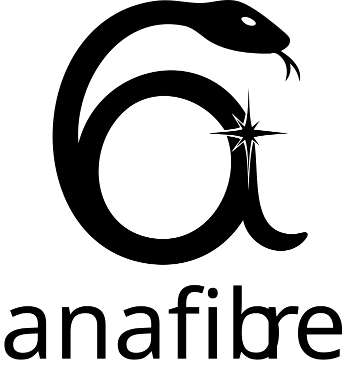

<h1>
<p align="center">
  <picture>
    <source media="(prefers-color-scheme: dark)" srcset="./logo-dark.svg">
    <source media="(prefers-color-scheme: light)" srcset="./logo-light.svg">
    
  </picture>
</p>
</h1><br>

[](https://opensource.org/licenses/MIT)
[](https://www.python.org/downloads/)


**Anafibre** is an analytical mode solver for cylindrical step-index optical fibres. It computes guided modes by solving dispersion relations and evaluating corresponding electromagnetic fields analytically.

## Features

- 🔬 **Analytical solutions** for guided modes in cylindrical fibres
- 🌈 **Mode visualisation** with plotting utilities for field components
- 📊 **Dispersion analysis** helpers and effective index calculations
- ⚡ **Fast computation** of propagation constants with SciPy-based root finding
- 🎯 **Flexible materials** support via fixed indices or callable/index-database inputs
- 📐 **Optional unit support** through Astropy

## Installation

### From Source (recommended for development)

```bash
git clone https://github.com/Sevastienn/anafibre.git
cd anafibre
pip install -e .
```

### Core dependencies

- numpy >= 1.20.0
- scipy >= 1.7.0
- matplotlib >= 3.5.0
- IPython >= 7.0.0

### Optional extras
- astropy >= 4.0.0 (for unit support) - install with `pip install anafibre[units]`
- refractiveindex >= 0.1.0 (for refractive index database) - install with `pip install anafibre[refractiveindex]`

### Future PyPI Release

The package will be available on PyPI soon:

```bash
pip install anafibre
```

## Quick Start

```python
import numpy as np
import anafibre as fib

# Create a step-index fibre
fibre = fib.StepIndexFibre(
    core_radius=250e-9,
    n_core=2.00,
    n_clad=1.33
)

# Get fundamental mode (HE11) at 500 nm
wl = 500e-9
HE11 = fibre.HE(ell=1, n=1, wl=wl)

# Display mode information  
display(HE11)

# For multi-mode fibres, get additional modes
try:
    TM01 = fibre.TM(n=1, wl=wl)         # TM01 mode
    HE21 = fibre.HE(ell=2, n=1, wl=wl)  # HE21 mode
    TE01 = fibre.TE(n=1, wl=wl)         # TE01 mode
    EH11 = fibre.EH(ell=1, n=1, wl=wl)  # EH11 mode
except:
    pass  # Mode may not exist for this fibre

fib.display_modes(HE11, TM01, HE21, TE01, EH11)

# Calculate field distributions on a grid
mode = HE11  # Use the mode from above
x = np.linspace(-2*fibre.core_radius, 2*fibre.core_radius, 100)
y = np.linspace(-2*fibre.core_radius, 2*fibre.core_radius, 100)
X, Y = np.meshgrid(x, y)

E = mode.E(x=X, y=Y)  # Electric field
H = mode.H(x=X, y=Y)  # Magnetic field
```

## Core API Overview

Anafibre revolves around two main abstractions:

- `StepIndexFibre` — defines the waveguide (geometry + materials)
- `GuidedMode` — represents a single solved eigenmode

The typical workflow is:


---

### `StepIndexFibre`

Defines the fibre geometry and material parameters and provides dispersion utilities.

#### Required inputs

- `core_radius` (float in meters or `astropy.units.Quantity`)
- Either:
  - `n_core`, `n_clad` (scalar or callable λ→ε(λ))
  - or `eps_core`, `eps_clad` (scalar or callable λ→ε(λ))
  - or `core`, `clad` as `RefractiveIndexMaterial`

Optional:
- `mu_core`, `mu_clad`

Example:

```python
fibre = fib.StepIndexFibre(
    core_radius=250e-9,
    n_core=2.00,
    n_clad=1.33
)

# or using permittivity or permeability

fibre = fib.StepIndexFibre(
    core_radius=250e-9,     # Core radius in meters (or multiplied by astropy.units)
    eps_core=4.00,          # Core permittivity (number or function of wavelength)
    eps_clad=1.77,          # Cladding permittivity (number or function of wavelength)
    mu_core=1.00,           # Core permeability  (number or function of wavelength)
    mu_clad=1.00,           # Cladding permeability (number or function of wavelength)
)

# or with astropy and refractiveindex packages:

import astropy.units as u

SiO2  = fib.RefractiveIndexMaterial(shelf='glass', book='fused_silica', page='Malitson')
H2O   = fib.RefractiveIndexMaterial(shelf='main', book='H2O', page='Hale')

fibre = fib.StepIndexFibre(
    core_radius=250*u.nm,
    core = SiO2,            
    clad = H2O 
)
```
If material properties are provided in more than one way, then the hierarchy is: RefractiveIndexMaterial > eps > n.

#### Provides
Mode constructors:

- HE(ell, n, wl, a_plus, a_minus)
- EH(ell, n, wl, a_plus, a_minus)
- TE(n, wl)
- TM(n, wl)

Each returns a `GuidedMode` object.

Dispersion utilities:
- b(ell, m, V=..., wavelength=...)
- neff(ell, m, ...)
- kz(ell, m, ...)
- V(wavelength)

### `GuidedMode`

Represents a guided mode with methods to calculate fields and properties. It is created using `StepIndexFibre` mode constructors.

Example:
```python
# Create the fundamental modes with different polarisations:
HE11L = fibre.HE(ell=1, n=1, wl=500e-9, a_plus=0, a_minus=1)                            # left circular polarisation
HE11x = fibre.HE(ell=1, n=1, wl=500e-9, a_plus=1/np.sqrt(2), a_minus=1/np.sqrt(2))      # linear x-polarisation
HE11y = fibre.HE(ell=1, n=1, wl=500e-9, a_plus=1j/np.sqrt(2), a_minus=-1j/np.sqrt(2))   # linear y-polarisation
```


#### Provides
- Field evaluation in (ρ,ϕ,z) or (x,y,z) coordinates, when z is not provided z=0 is assumed
  ```python
  E = mode.E(rho=Rho, phi=Phi, z=Z)  # Cylindrical coordinates
  H = mode.H(rho=Rho, phi=Phi, z=Z)  # Cylindrical coordinates
  E = mode.E(x=X, y=Y, z=Z)          # Cartesian coordinates
  H = mode.H(x=X, y=Y, z=Z)          # Cartesian coordinates
  ```
 Both return arrays with a shape (..., 3) corresponding to the Cartesian vector components.
- Jacobians (gradients) of the fields
  ```python
  J_E = mode.gradE(rho=Rho, phi=Phi, z=Z)  # Cylindrical coordinates
  J_H = mode.gradH(rho=Rho, phi=Phi, z=Z)  # Cylindrical coordinates
  J_E = mode.gradE(x=X, y=Y, z=Z)          # Cartesian coordinates
  J_H = mode.gradH(x=X, y=Y, z=Z)          # Cartesian coordinates
  ```
 Both return arrays with a shape of (..., 3, 3), corresponding to the Cartesian tensor components.
- Power evaluated via numerical integration
  ```python
  P = mode.Power()
  ```


### Visualization
The package ships with a built-in plotting utility that creates time-resolved animations of the electromagnetic field in the transverse cross-section of the fibre:
```python
from anafibre.plotting import animate_fields_xy
from IPython.display import HTML
anim = animate_fields_xy(modes=mode, show=("E",),figsize=(5,5))
display(HTML(anim.to_jshtml()))
```

## Optional Dependencies

- **astropy**: For unit handling and dimensional analysis
  ```bash
  pip install astropy
  ```

## Examples

Check out the `notebooks/` directory for detailed examples:

- Basic fibre mode calculations
- Dispersion analysis
- Mode field visualisation  
- Multi-mode fibre analysis

## Requirements

- Python ≥ 3.8
- NumPy ≥ 1.20.0
- SciPy ≥ 1.7.0
- Matplotlib ≥ 3.5.0
- refractiveindex ≥ 0.1.0
- IPython ≥ 7.0.0

## Contributing

Contributions are welcome! Please feel free to submit a Pull Request. For major changes, please open an issue first to discuss the changes you would like to make.
## License

This project is licensed under the MIT License - see the [LICENSE](LICENSE) file for details.

## Citation

If you use Anafibre in your research, please cite:

```bibtex
@misc{anafibre2026,
  author = {Golat, Sebastian},
  title = {Anafibre: Analytical mode solver for cylindrical step-index fibres},
  year = {2026},
  url = {https://github.com/Sevastienn/anafibre},
  version = {0.1.0}
}
```
